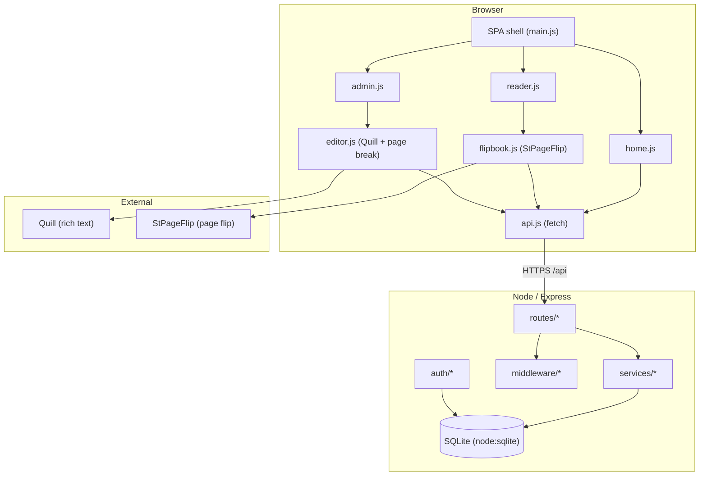
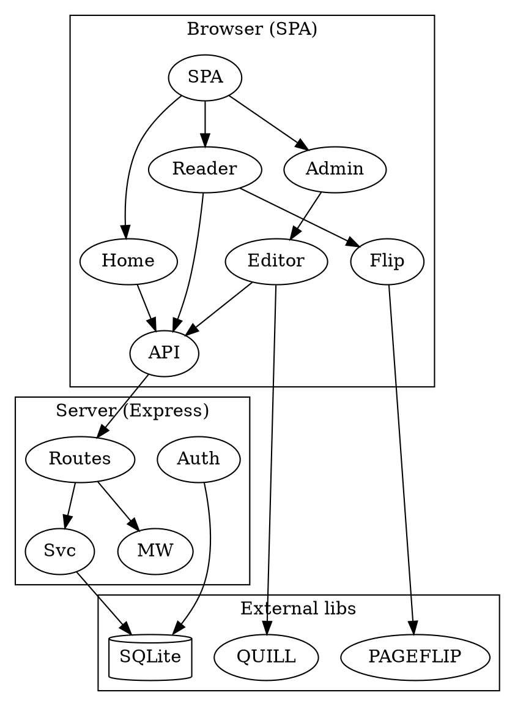

# FlipBlog — Architecture

This document describes the internal architecture of FlipBlog: a flippable, book-style blog platform with an admin
dashboard. It complements `README.md` (setup/usage) with module-level detail.

## Component overview

## Module responsibilities

### Server (`server/src`)
- **`config.js`** — loads env (`PORT`, `APP_SECRET`, `ADMIN_*`, `DB_PATH`, upload dirs); exposes `isMemoryDb`.
- **`db.js`** — lazily creates the singleton `DatabaseSync` connection, applies the schema (FK on, busy_timeout),
  returns `getDb()` / `closeDb()`.
- **`app.js`** — builds the Express app: cookie parsing (zero-dep), JSON body, `/api` `no-store` cache header, route
  mounting, static serving of `server/public`, SPA history fallback, central error handler.
- **`index.js`** — seeds the admin + sample posts, then listens.
- **`seed.js`** — seeds the two World Cup articles (copying their images into `uploads/`) when the DB is empty.
- **`auth/jwt.js`** — HS256 sign/verify over `node:crypto` (no `jsonwebtoken` dependency).
- **`auth/password.js`** — `scrypt` hash + timing-safe verify.
- **`middleware/validate.js`** — `zod` schemas for login, registration, and post payloads; `validateBody` returns `400` with details.
- **`middleware/requireAuth.js`** — verifies the session cookie, attaches `req.user` (incl. `role`), `401` otherwise; `requireRole(role)` guards admin-only routes (`403`).
- **`routes/auth.js`** — login (sets cookie), logout, `me` (incl. `created_at` + `avatar`), admin-only
  `register` (creates users), `change-password` (authenticated users update their own password), and
  `avatar` (authenticated users upload/change their profile picture).
- **`middleware/upload.js`** — shared `multer` disk storage (random UUID filename, image-only filter,
  size limit) + `uploadErrorHandler` (maps `LIMIT_FILE_SIZE` → 413, bad type → 415). Used by both
  `routes/uploads.js` and the avatar route.
- **`routes/posts.js`** — CRUD + `by-id` + list; delegates to `services/posts.js`.
- **`routes/uploads.js`** — `multer` image upload to `public/uploads`, returns URL.
- **`services/posts.js`** — business logic: slugify (accent-stripping), unique-slug guarantee, sanitize, excerpt
  derivation, pagination wiring, CRUD over `db`.
- **`services/paginate.js`** — pure `splitIntoPages(html)` → ordered pages (markers → headings → chunking).
- **`services/sanitize.js`** — `sanitize-html` allow-list (keeps `data-page-break`); `sanitizeText` for plain fields.
- **`services/admin.js`** — user lookup (`getAdminByUsername`), `authenticate` (returns `role`), `createUser`, and
  `seedAdminIfMissing` (seeds an `admin` role on first run).

### Web (`web/src`)
- **`main.js`** — mounts the shared shell (header/footer), wires the hash router, manages per-view cleanup, and the
  persistent dark-mode toggle.
- **`lib/api.js`** — typed `fetch` wrapper (JSON + multipart), credentialed.
- **`lib/router.js`** — hash router with `:param` matching and `getHashRoute` / `navigate`.
- **`lib/dom.js`** — `h()` hyperscript helper + `clear()`.
- **`lib/format.js`** — `formatDate`.
- **`components/header.js`** — nav adapts to auth state (Entrar ↔ Painel).
- **`components/footer.js`** — static footer.
- **`components/flipbook.js`** — wraps `StPageFlip`: builds `.fb-page` elements from `post.pages`, wires control bar
  (prev/next/indicator/zoom/fullscreen/share), keyboard nav, and `destroy()` cleanup (removes listeners).
- **`components/editor.js`** — Quill instance + a custom **Insert page break** button (registers a `pageBreak`
  `BlockEmbed` that renders `
`), cover upload, `getContent()`.
- **`pages/home.js`** — card grid of published posts.
- **`pages/reader.js`** — fetches a post and mounts the flipbook; returns a cleanup fn.
- **`pages/login.js`** — admin login form.
- **`pages/profile.js`** — user profile (avatar upload/change, summary, change-password, subscription placeholder).
- **`pages/admin.js`** — dashboard table (list/edit/delete) + editor view (new/edit).

## Key data flows

### Publish a post (admin)
1. Admin logs in → `POST /api/auth/login` → server verifies `scrypt` hash, returns HS256 JWT in httpOnly cookie.
2. Admin fills the editor (title, author, excerpt, cover upload, Quill content), clicks **Insert page break** to mark
   page boundaries, then **Salvar**.
3. `POST /api/posts` (cookie-auth) → `services/posts.createPost` → `sanitize-html` → store HTML + metadata in
   `posts`. Response includes the slug.
4. Client navigates to `#/admin` (dashboard) — `GET /api/posts?status=all`.

### Read a post (public)
1. `GET /api/posts` lists published posts (home grid).
2. User opens `#/read/:slug` → `GET /api/posts/:slug` → server reads the row, runs `splitIntoPages(content)` and
   returns `{ post, pages[] }`.
3. `reader.js` mounts `flipbook.js` → one `.fb-page` element per page → `StPageFlip.loadFromHTML` renders the
   flippable book with controls.

### Async / sync boundaries
- All I/O is **synchronous** on the server (`node:sqlite`, `scrypt`), so request handlers are simple and race-free per
  request. The only asynchrony is network/HTTP.
- The front-end is fully client-side; there is no SSR. The single Node process serves both the JSON API and the built
  static assets, so there is one deployment unit.

## Testing & quality
- **Server**: `node:test` + `supertest` — `paginate` (pure), `auth` (login/me/logout/guard), `posts`
  (CRUD, validation, draft filtering, XSS sanitization). Runs against an isolated `:memory:` DB.
- **Web**: `vitest` — `api` (mocked fetch), `router`, `flipbook` (mocked `page-flip`), `dom`.
- **E2E**: `playwright` — home lists posts, reader flips, admin logs in and publishes a flipbook.
- `npm run lint` syntax-checks every source/test file in both packages.

## Extension points
- **Roles & permissions**: the `users` table (renamed from `admin` by migration 004) has a `role`
  column (`admin`/`author`) and `requireRole('admin')` guards the registration endpoint. Extend it
  with finer-grained permissions or per-post authorship (link `posts.owner_user_id` to `users.id`).
  The display byline is a separate `posts.author_display_name` column; `owner_user_id` is the
  authenticated-account ownership foreign key and is never exposed via the public API.
- **Categories / tags**: new columns + `services/posts.js` filters; expose in the list API.
- **Comments / reactions**: new table + routes; render in `reader.js`.
- **Rich media pages**: `components/editor.js` can be extended with image/video embeds; `sanitize-html` allow-list
  already permits images.
- **Search**: full-text index on `posts` + a `/api/posts?q=` route; add a search box to `home.js`.

## Known limitations
- No public self-signup by design: only an authenticated `admin` can register new users (via
  `#/register` or `POST /api/auth/register`).
- SQLite is the datastore; for high scale, swap `db.js` for Postgres/MySQL — `services/*` are storage-agnostic.
- The dev toolchain (Vite/esbuild) carries advisories that do not ship in the production bundle.
